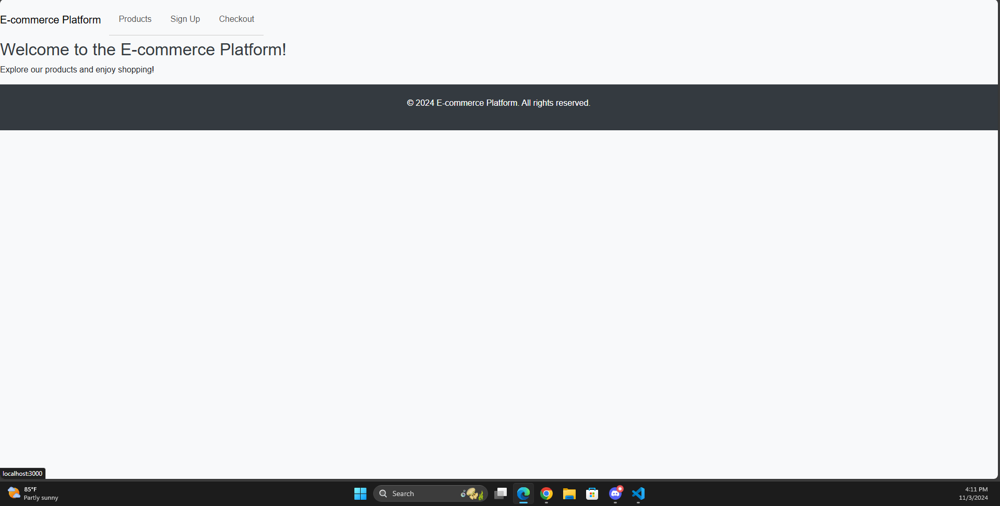
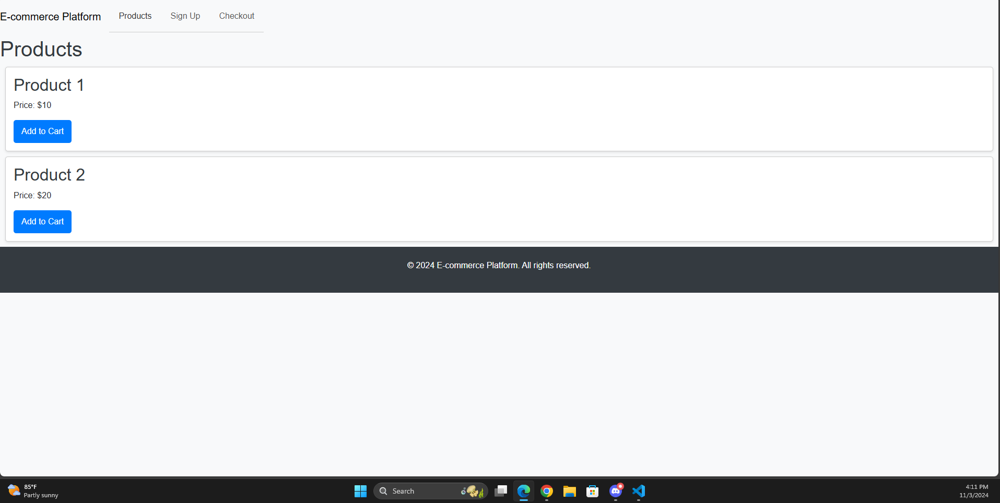
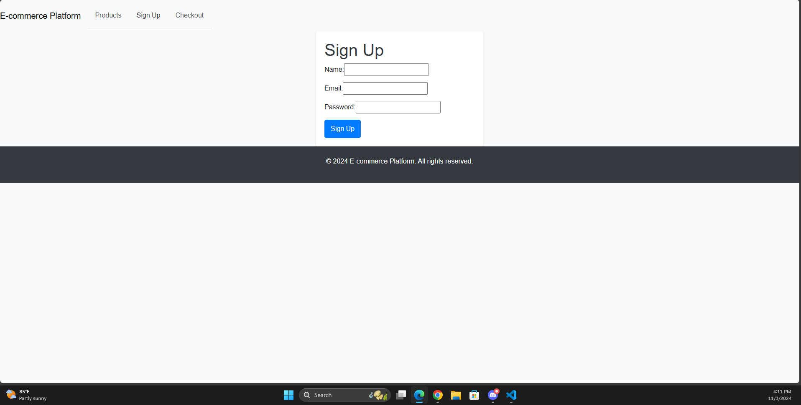
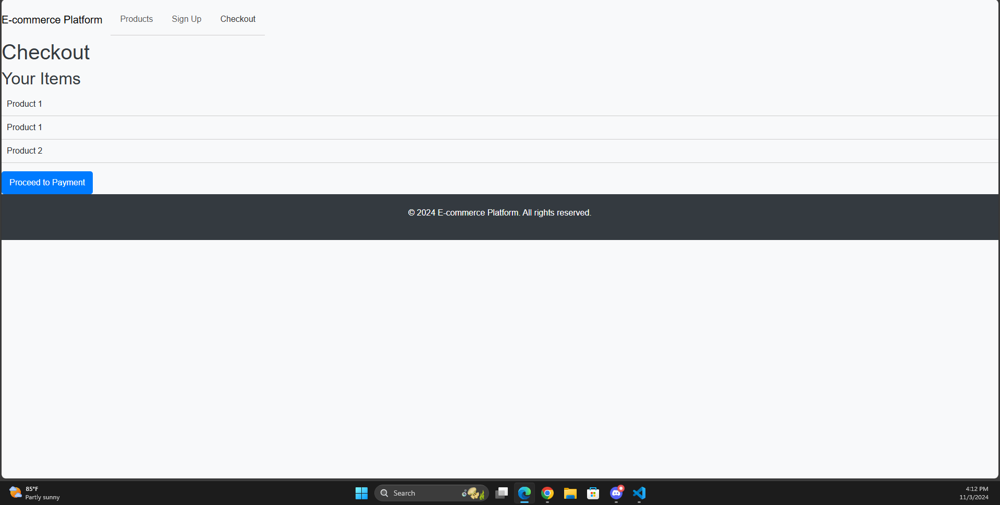

# State-ReduxStore

## Description
    Welcome to the E-commerce Platform project! This is a React-based web application that allows users to browse products, sign up, and proceed to checkout. It utilizes Redux for state management and includes features such as a shopping cart and user authentication. On this project I had trouble to render the application, when trying to build the application it would fail. 

## Table of Contents
    Features
    Technologies Used
    Getting Started
    Usage
    Deployment
    Contributing
    License
## Features
    - Browse a variety of products
    - Add products to a shopping cart
    - User signup and authentication
    - Checkout process to complete purchases
    - Responsive design for mobile and desktop users
## Technologies Used
    Frontend: React, Redux, React Router
    State Management: Redux, Redux Thunk
    Styling: CSS (with optional frameworks like Bootstrap or Material-UI)
    Build Tools: Create React App
## Getting Started
    To get started with this project:

    Clone the Repository:
    git clone https://github.com/LuccaBertoldi/State-ReduxStore.git
    cd State-ReduxStore

    Install Dependencies:
    npm install

    Build the application: 
    npm run build

    Run the Development Server:
    npm start
    Your application should now be running on http://localhost:3000.

## Usage
    Home Page: View a welcome message and access links to other pages.
    Products Page: Browse products and add them to your cart.
    Signup Page: Create an account to access additional features.
    Checkout Page: Review your cart and proceed with the purchase.

## License
    This project is licensed under the MIT License. See the LICENSE file for details.

## Screenshots
    
    
    
    